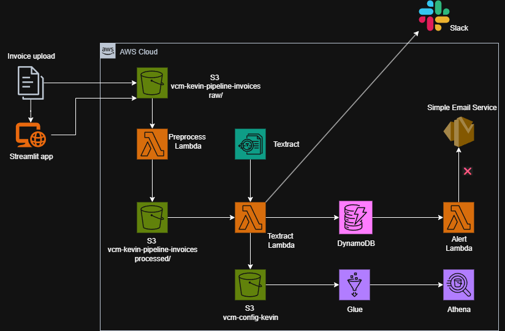
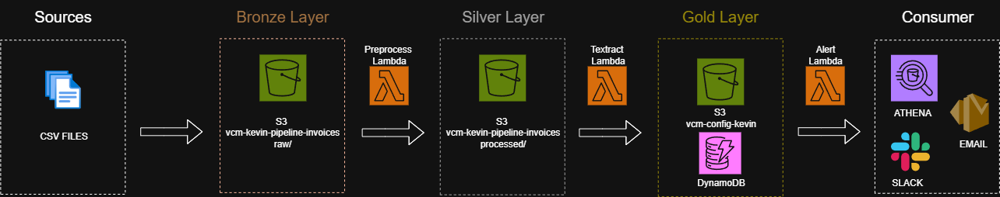
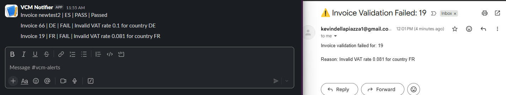

# ✅ VCM — VAT Compliance Monitor

[](https://github.com/kevindellapiazza/vat-compliance-monitor/actions)
[](https://aws.amazon.com/serverless/sam/)

> An end-to-end, serverless pipeline on AWS for real-time validation of European VAT invoices. Fully deployed and managed with Infrastructure as Code.

---

## 📌 Project Overview

**VCM (VAT Compliance Monitor)** is a production-grade, event-driven pipeline that automates the validation of European VAT invoices. The entire system is defined and deployed using **Infrastructure as Code (IaC)** with the AWS SAM Framework.

This project solves a critical business problem by transforming unstructured, real-world PDF invoices **including low-quality scans** into validated, auditable, and analytics-ready records, all automatically.
It evolves beyond traditional OCR by implementing a Hybrid **GenAI Architecture**, leveraging **AWS Bedrock** (Claude 3 Haiku) to semantically understand document layouts.

---

## 🌐 Interactive Preview

Test the full invoice compliance pipeline via the cloud-hosted Streamlit interface:
🔗 **[Launch Validation App](https://vat-compliance-monitor-lfentssvkbaggt5qrfekkb.streamlit.app/)** 📤

Upload a sample invoice to trigger real-time processing, validation, and alerts.

---

## 🗺️ System Architecture

This diagram shows how invoices flow through the system from upload to validation and analytics.



### Medallion layers
The project follows the Medallion Architecture approach, structuring data into three distinct layers:

* **Bronze:** for storing raw, ingested data.
* **Silver:** for cleaned, processed, and transformed data.
* **Gold:** for business-ready datasets.




This layered design improves data quality, reliability, and usability. **[Full methodology here](https://github.com/kevindellapiazza/data-foundations-for-ai)**

---

## 🚀 How It Works (The Intelligence Pipeline)

1.  **Ingestion & Preprocessing:**
    A user uploads a PDF to the `raw/` prefix in the **Invoice Bucket**. This S3 event triggers a Docker-based **`preprocess-lambda`** that uses `ocrmypdf` to deskew, clean noise, and apply a text layer to scanned documents, ensuring high-quality input for the AI.

2.  **Hybrid GenAI Extraction (The Core):**
    The new file in the `processed/` prefix triggers the **`textract-lambda`**, which executes a 3-step intelligence pipeline:
    * **Vision Layer (Textract):** Uses **Amazon Textract** to extract raw text from the document pixels.
    * **Semantic Layer (GenAI):** Sends the raw text to **AWS Bedrock (Claude 3 Haiku)** via secure PrivateLink. The LLM intelligently identifies key entities (VAT ID, Total, Rates, Currency) regardless of the document layout.
    * **Deterministic Guardrails:** A Python logic layer performs mathematical cross-checks (e.g., `Net Total * Rate == VAT Amount`) to validate the AI's output against strict tax rules.

3.  **Storage & State:**
    * Validation status (`PASS`/`FAIL`) is saved to **Amazon DynamoDB** for real-time tracking.
    * Structured data is converted to **Parquet** and saved to the separate **Analytics Bucket** (`vcm-config-kevin`) for BI.
    * An operational update is sent to **Slack** for monitoring.

4.  **Critical Alerting:**
    A `FAIL` status written to DynamoDB triggers the **`alert-lambda`** via a DynamoDB Stream. This function sends a detailed failure notification via **Amazon SES (email)** to the finance team.

5.  **Serverless Analytics:**
    An **AWS Glue Crawler** catalogs the Parquet files from the Analytics Bucket, making them instantly queryable using standard SQL in **Amazon Athena**.

---

## ✨ Key Features & Architectural Highlights

1.  **100% Infrastructure as Code (IaC):** The entire cloud infrastructure: S3 buckets, DynamoDB tables, all three Lambda functions, IAM roles, and event triggers, is defined in a single `template.yaml` file. The whole system can be reliably deployed in any AWS account with a single `sam deploy` command.

2.  **Automated Preprocessing for "Dirty" PDFs:** The system solves the common problem of unreadable documents. A Docker-based Lambda function uses `ocrmypdf` to clean and apply a text layer to any incoming PDF, ensuring even scanned documents are machine-readable.

3.  **AI-Powered Data Extraction:** **AWS Textract + AWS Bedrock (Claude 3 Haiku)** intelligently extracts structured data (VAT IDs, amounts, dates) from the cleaned PDFs, overcoming variations in invoice layouts.

4.  **Data Lake & Analytics Layer:** Processed data is saved in the optimized **Parquet** format. An **AWS Glue Crawler**, also defined as code, automatically catalogs this data, making it instantly queryable via standard SQL with **Amazon Athena**.

---

## 🎯 Why This Matters

-   💸 Businesses lose dozens of hours per month manually validating invoices for tax compliance.
-   ❌ Small VAT mismatches can lead to major penalties, audit failures, or rejected tax filings.
-   📉 Most companies still rely on spreadsheets and shared drives for compliance workflows.

As a data and cloud engineer, I designed VCM to showcase how automation can transform financial operations.

---

## ⚡ The Result

A system that is:

- ✅ **Smart Compliance:** flags errors in incorrectly filled invoices and confirms valid ones
- ✅ **Scalable:** can handle hundreds of invoices per day  
- ✅ **Cost-effective:** runs on AWS with near-zero infrastructure cost  
- ✅ **Fully automated:** no human intervention required  

---

## 🔐 Enterprise Grade Security & Compliance (GDPR/FADP)

This architecture is engineered for **Banking & Healthcare standards**, ensuring total data sovereignty. Unlike standard API integrations (e.g., public ChatGPT), this solution utilizes **AWS Bedrock** to guarantee:

* **Zero Data Retention:** Under AWS Bedrock terms, input/output data is **NEVER** used to train the base foundation models. Your data remains yours.
* **Data Sovereignty:** Inference occurs strictly within the selected AWS Region (e.g., `eu-central-1`), ensuring data never crosses geopolitical borders, compliant with **GDPR** and **Swiss FADP**.
* **Network Isolation:** The Lambda function communicates with the AI Model via **AWS PrivateLink**, meaning sensitive invoice data never traverses the public internet.
* **Encryption:** All data is encrypted in transit (TLS 1.2+) and at rest (KMS AES-256).

### ⚖️ Legal Framework & DPA
By utilizing the AWS Bedrock abstraction layer, this architecture adheres to:
* **Anthropic Data Processing Addendum (DPA):** Compliant with EU SCCs (Standard Contractual Clauses).
* **Swiss Addendum:** Specific compliance for the Swiss Federal Act on Data Protection.

---

## 🛡️ AI Reliability: The "Trust but Verify" Protocol

How do we ensure the AI doesn't "hallucinate" financial numbers?
We implement a **Deterministic Validation Layer** post-extraction.

1.  **AI Extraction:** Claude 3 Haiku extracts the fields contextually (flexible).
2.  **Math Cross-Check:** The Python layer strictly validates the math:
    > `If (Net_Total * VAT_Rate) != VAT_Amount` (±0.05 tolerance) → **REJECT**
3.  **Result:** If the math doesn't add up, the document is flagged for human review.

This Hybrid approach gives us the **flexibility** of GenAI with the **safety** of deterministic code.

---

## 📊 Analytics-Ready Data Lake

The pipeline is designed for more than just real-time processing; it creates an **analytics-ready data lake**.

1.  The `VcmTextractLambda` saves all results to an S3 bucket in the high-efficiency columnar **Parquet** format.
2.  An **AWS Glue Crawler** scans these files and automatically populates the AWS Data Catalog.
3.  The data is immediately available for complex SQL analysis via **AWS Athena**, without the need for a database.

The query below successfully retrieves data from the data lake and returns the results from our batch test, confirming that the pipeline is fully operational from upload to analysis.


---

## 🔔 Observability & Alerting in Action

The system implements a **Multi-Channel Notification Strategy** to ensure rapid incident response.



* **Slack (Operational Feed):** A real-time stream of every processed invoice. Used by the DevOps/Ops team to monitor throughput and general system health.
* **Email SES (Critical Alert):** A targeted alert sent to the Finance Team **only** when a validation fails (`status: FAIL`), allowing for immediate manual intervention.

---


## 💰 Cloud Cost Estimate (10,000 Invoices / Month)

This system is optimized for affordability, even at an enterprise scale.  
All costs are based on **eu-central-1 (Frankfurt)** region.

### 🧮 Monthly Cost — 10,000 Invoices (Enterprise Usage)

| Service | Approx. Cost | Description |
| :--- | :--- | :--- |
| **Textract OCR** | $15.00 | 1 page/invoice × 10,000 × $0.0015 |
| **Bedrock AI** | **$4.50** | **GenAI Extraction** (Claude 3 Haiku). ~$0.00045 per invoice (Input+Output tokens). |
| **Lambda compute** | $0.20 | Slightly higher runtime for AI calls (~1000ms avg). |
| **Amazon SES** | $1.00 | 10,000 failure/success alerts emails. |
| **S3 Storage** | ~$0.20 | PDFs (Raw/Processed) + Parquet Data Lake. |
| **Glue + Athena** | ~$1.00 | 1 crawler run + ~50 analytical queries. |
| **TOTAL** | **~$21.90 / month** | **Fully serverless, GenAI-powered pipeline.** |

> 🔍 **FinOps Insight:** Even with advanced Generative AI, the cost per invoice remains **under $0.003**. The ROI compared to manual data entry (human cost) is >100x.

---

## 🔐 AWS Security Best Practices (Deployed in eu-central-1)

| Layer     | Practice |
|-----------|----------|
| **S3**    | Server-side encryption (SSE-S3) enabled by default |
| **IAM**   | Each Lambda has least-privilege IAM roles (S3 + logging only) |
| **SES**   | Sandbox mode; verified sender & recipients only |
| **Parquet Output** | Stored in private S3 path, queryable only via Athena |
| **Monitoring** | CloudWatch logs + EventBridge alerts on failures |
| **No Public Access** | All resources use private IAM-authenticated triggers |

> ✅ Compliant with AWS’s Well-Architected security pillar.

---


## 📦 Deployment

The entire infrastructure for this project is defined in the `sam/template.yaml` file and deployed as a single, cohesive stack using the AWS SAM Framework.

#### Prerequisites
-   AWS Account & IAM User
-   AWS CLI (configured with credentials)
-   AWS SAM CLI
-   Docker Desktop

#### Deployment Steps
1.  **Clone the repository:**

    ```bash
    git clone [https://github.com/kevindellapiazza/vat-compliance-monitor.git](https://github.com/kevindellapiazza/vat-compliance-monitor.git)
    cd vat-compliance-monitor
    ```
2.  **Build the application:**

    ```bash
    sam build -t sam/template.yaml
    ```
    This command builds the Docker image and packages the Lambda functions.
3.  **Deploy the stack:**

    ```bash
    sam deploy --guided
    ```
    This command starts a guided deployment. You will be prompted to enter parameters for your unique bucket name and secrets (emails, Slack URL).

---

## 🔧 Tools & Technologies

-   **IaC:** AWS SAM CLI
-   **Compute:** AWS Lambda (Python 3.12 Runtime & Docker Container Image)
-   **AI / OCR:** AWS Textract, AWS Bedrock (Claude 3 Haiku)
-   **Storage:** Amazon S3, Amazon DynamoDB
-   **Data Analytics:** AWS Glue, Amazon Athena
-   **Alerting:** Amazon SES, Slack Webhooks
-   **CI/CD:** GitHub Actions
-   **Frontend:** Streamlit

---

## 🧠 Skills Demonstrated

-   **Infrastructure as Code (IaC):** Designed and deployed a complete, multi-resource cloud application from a single, reusable AWS SAM template.
-   **Serverless & Event-Driven Architecture:** Built a robust, scalable, and cost-efficient pipeline using S3 event triggers, Lambda functions, and DynamoDB Streams.
-   **AI/ML Integration:** Leveraged AWS Textract and AWS Bedrock for intelligent document processing (OCR) to extract structured data from unstructured PDFs.
-   **Data Engineering:** Created a data pipeline that transforms and stores data in an analytics-optimized format (Parquet) and built a data catalog with AWS Glue for querying in Amazon Athena.
-   **CI/CD & DevOps:** Implemented a Continuous Integration workflow with GitHub Actions to automate code quality checks and testing.
-   **Cloud Security:** Applied the principle of least privilege with specific IAM roles for each service and managed secrets securely outside of version control using parameters.

---

## ✅ Continuous Integration (CI)

This project uses **GitHub Actions** to automatically run quality checks on every commit:
-   Check code quality with **Ruff**.
-   Run tests with **Pytest**.

---

## 📦 Configuration

Validation logic is driven by the file:  
`data/allowed-vat-rates.csv`

This file maps each country code to its allowed VAT rates and enables country-specific rule checks.  
Making this external (not hardcoded) ensures scalability and maintainability.

---

## 🛡️ License & Use

This project is published for educational and portfolio purposes only.  
All code was written by **Kevin Della Piazza**.

You may:
- ✅ Read and learn from this project  
- ✅ Ask to test it as part of a job application  

You may not:
- ❌ Reuse the code in other portfolios, applications, or commercial tools  

**All rights reserved © Kevin Della Piazza**
