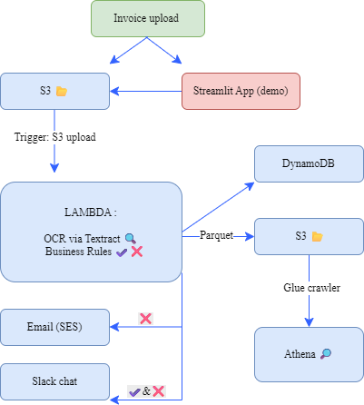

# ✅ VCM — Real-Time VAT Invoice Compliance Powered by AI + AWS Serverless

## 📌 Project Overview

**VCM (VAT Compliance Monitor)** is a real-time invoice validation pipeline built entirely on a fully serverless AWS architecture.  
It transforms unstructured PDF invoices into validated, auditable, and analytics-ready records in just seconds — without any manual steps.  

Built using **AWS Textract**, **Lambda**, **DynamoDB**, **SES**, and **Slack**, VCM enforces VAT compliance rules at scale and delivers real-time feedback through alerting systems.  
From OCR to validation to storage, everything runs automatically — no servers, no queues, no spreadsheets.  

This project simulates a real-world FinOps and compliance automation use case, demonstrating how **AI + Cloud** can streamline business-critical document workflows.

---

## 🎯 Why This Matters

- 💸 Businesses lose dozens of hours per month manually validating invoices for tax compliance.  
- ❌ Small VAT mismatches can lead to major penalties, audit failures, or rejected tax filings.  
- 📉 Most companies still rely on spreadsheets and shared drives for compliance workflows.  

VCM automates this process end to end — intelligently, scalably, and cost-effectively.  
As a data scientist working at the intersection of data science, AI, and cloud, I built VCM to reflect the kind of automation modern finance teams need:

- 🧠 **AI-powered OCR** (AWS Textract) reads scanned invoices and extracts key tax and payment details  
- ⚙️ **Serverless compute** (Lambda) applies VAT validation logic — checking for required fields, matching rates, and country-specific rules  
- 💾 **Fully managed storage** (DynamoDB + Parquet with Athena) supports both real-time feedback and historical reporting  
- 🔔 **Real-time alerts** via Slack and SES notify the right people at the right time — instantly  

---

## ⚡ The Result

A system that is:

- ✅ **Smart Compliance** — flags errors in incorrectly filled invoices and confirms valid ones
- ✅ **Scalable** — can handle hundreds of invoices per day  
- ✅ **Cost-effective** — runs on AWS with near-zero infrastructure cost  
- ✅ **Fully automated** — no human intervention required  

---

## 🌐 Interactive Preview

Test the full invoice compliance pipeline via this cloud-hosted **Streamlit** interface:  
🔗 [Launch Validation App](https://vat-compliance-monitor-lfentssvkbaggt5qrfekkb.streamlit.app/)  
Upload a sample invoice to trigger real-time processing, validation, and alerts.
---

## 🗺️ System Architecture

This diagram shows how invoices flow through the system from upload to validation and analytics.

---

## 🚀 How It Works (Step-by-Step)

1. 📤 **Invoice Upload**  
   A user uploads one or more PDF invoices to an **S3** bucket.

2. ⚙️ **OCR with Textract**  
   - An S3 event triggers a **Lambda** function.  
   - **Textract** processes each PDF and extracts structured fields including:
     - Supplier name  
     - VAT ID  
     - Total amount  
     - Line items  

3. ✅ **Validation Logic**  
   - The Lambda function parses and validates extracted fields against VAT compliance rules:
     - Valid supplier VAT ID  
     - Correct VAT rate based on country  
     - Accurate VAT amount (mathematical validation)  
   - The output is classified as a success or failure based on rule checks.

4. 💾 **Data Storage**  
   Validation results are saved in:
   - **DynamoDB** for real-time access and alerting  
   - **Parquet files in S3** for long-term storage and analytics  

5. 🔔 **Alerting System**  
   - A **Slack message** is sent for every processed invoice  
   - If validation fails, an **email alert via SES** is sent to notify the appropriate team  

6. 📊 **Analytics Layer**  
   - Data is made queryable through **Athena + Glue**, enabling analysis of:
     - VAT trends  
     - Failure rates  
     - Invoice volumes  
     - Validation errors  
     - Country-level compliance performance

---

## 🔧 Tools & Technologies

- **AWS Textract** – Intelligent document processing (OCR)  
- **AWS Lambda** – Stateless compute for parsing and validation logic  
- **Amazon S3** – Object storage for PDFs and Parquet files  
- **Amazon DynamoDB** – Real-time NoSQL database for structured validation results  
- **Amazon Athena + AWS Glue** – Serverless analytics for historical queries  
- **Amazon SES** – Automated email alerts on validation failures  
- **Slack API** – Real-time operational notifications  
- **Streamlit** – Frontend interface for testing and demonstration  

---

## 🧠 Skills Demonstrated

- **AI/ML Integration** – Used AWS Textract to extract structured data from unstructured invoices (OCR).  
- **Cloud-Native Development** – Designed a fully serverless pipeline using AWS Lambda, S3, and DynamoDB.  
- **Event-Driven Architecture** – Built real-time workflows triggered by document uploads.  
- **Compliance Logic Automation** – Applied business rules (e.g., VAT validation) programmatically at scale.  
- **Alerting & Monitoring** – Integrated Slack and SES for automated validation alerts.  
- **Data Modeling** – Stored validation results in formats optimized for both live dashboards and analytics (DynamoDB + Parquet).  
- **Analytics Enablement** – Queried processed data using Athena + Glue for trend and compliance insights.  

---

## 📦 Deployment Notes

This project was originally deployed manually using the AWS Console.  
The included `sam/template.yaml` file is a clean infrastructure blueprint for redeploying the stack using **AWS SAM** if desired.

---

## 🛡️ License & Use

This project is published for educational and portfolio purposes only.  
All code was written by **Kevin Della Piazza**.

You may:
- ✅ Read and learn from this project  
- ✅ Ask to test it as part of a job application  

You may not:
- ❌ Reuse the code in other portfolios, applications, or commercial tools  

**All rights reserved © Kevin Della Piazza**
